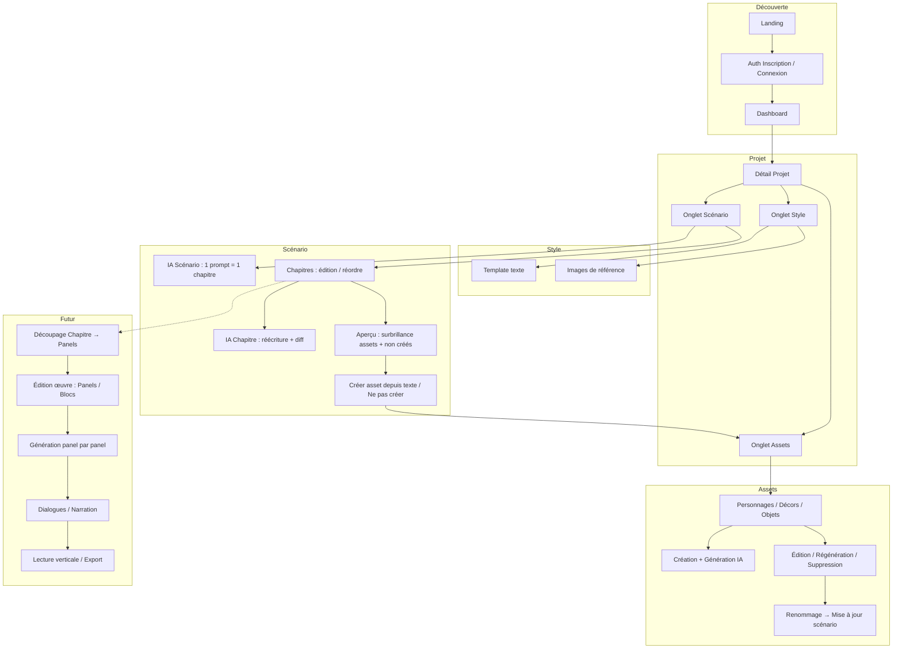

# UX — Parcours utilisateur DreamWeave

> Documentation de l’expérience utilisateur actuelle et prévue : chaque étape du parcours, écrans et flux, puis schéma global.

---

## Sommaire

1. [Conventions](#1-conventions)
2. [Parcours UX actuels (étape par étape)](#2-parcours-ux-actuels-étape-par-étape)
3. [Parcours UX à venir](#3-parcours-ux-à-venir)
4. [Schéma global de l’UX](#4-schéma-global-de-lux)
5. [Références croisées](#5-références-croisées)

---

## 1. Conventions

- **Actuel** : implémenté et livré (février 2026).
- **À venir** : prévu dans la roadmap (Phase 2 et au-delà).
- Les écrans et actions sont décrits du point de vue de l’utilisateur.

---

## 2. Parcours UX actuels (étape par étape)

### 2.1 Découverte et inscription

| Étape | Écran / action | Détail |
|-------|----------------|--------|
| 1 | **Landing page** | Présentation du produit, CTA « Commencer gratuitement ». Thème clair/sombre. |
| 2 | **Inscription** | Email + mot de passe + nom d’affichage, ou **Continuer avec Google** (OAuth). Profil créé automatiquement. |
| 3 | **Connexion** | Même formulaire ; message d’erreur si échec. Session persistante. |
| 4 | **Redirection** | Après auth → **Dashboard**. |

---

### 2.2 Dashboard -> *A revoir*

| Étape | Écran / action | Détail |
|-------|----------------|--------|
| 1 | **Vue d’ensemble** | Message de bienvenue, liste des projets (grille responsive). |
| 2 | **Statistiques** | Nombre de projets, assets, usage mensuel (barre + quota Free/Pro). Badge tier (Free / Pro). |
| 3 | **Actions** | Créer un projet, accéder au profil, déconnexion. |
| 4 | **Recherche / filtre** | Recherche et filtrage des projets. |

---

### 2.3 Projet : entrée et onglets

| Étape | Écran / action | Détail |
|-------|----------------|--------|
| 1 | **Détail projet** | Titre, description ; **onglets** : Style, Assets, Scénario, Édition de l'œuvre |
| 2 | **Navigation** | Clic sur un onglet → contenu correspondant. Onglet actif mis en évidence. |
| 3 | **Édition projet** | Modification du titre, description et nombre cible de panels par chapitre (sauvegarde). |

---

### 2.4 Onglet Style

| Étape | Écran / action | Détail |
|-------|----------------|--------|
| 1 | **4 templates prédéfinis** | Manga (N&B, screentone), Webtoon Coréen (couleur, digital), Manhwa Chinois (épique), **Européen** (trait lisible, BD). Grille 2×2, carousel. |
| 2 | **Sélection + validation** | Clic sur une carte → état `isPending` (ring mint). Bouton **"Valider ce style"** (première fois) ou **"Appliquer — [Nom]"** (changement). États : `isSavedIdle` (border primary/40), `isLocked` (ring primary + ✓). Badge "Style actif" supprimé. |
| 3 | **Vue détail** | Grille 3×1 : images personnage / décor / scène générées par le style + description. |
| 4 | **Style System V1** | `style_template` = bloc STYLE_SYSTEM_V1 structuré (metadata + prompts de référence + règles visuelles). Jamais envoyé depuis un draft — toujours depuis `project.style_template` en BDD. |
| 5 | **Précisions projet** | Champ texte optionnel "Contraintes additionnelles" injecté dans le template. |
| 6 | **Images de référence** | Upload 2 images max (Pro uniquement), aperçu, suppression. Stockage Supabase Storage. Plan Free : badge Pro + hint. |
| 7 | **Prochaines étapes** | Après style sauvegardé : 2 liens rapides vers Scénario et Assets. |

---

### 2.5 Onglet Assets

| Étape | Écran / action | Détail |
|-------|----------------|--------|
| 1 | **Onglets + recherche** | 3 onglets : **Personnages** (Users), **Décors** (MapPin), **Objets** (Box). **Barre de recherche** par nom + **dropdown filtre** fusionné avec l’onglet actif (source unique de vérité). Assets filtrés en temps réel. |
| 2 | **Liste** | Grille d’assets avec image (ou placeholder), nom, type. **Badge type** sur chaque carte (Perso/Décor/Objet, couleurs design system). |
| 3 | **Ajout** | Bouton contextuel (« Ajouter un personnage » / « Ajouter un décor » / « Ajouter un objet » selon filtre actif) → dialog : type pré-sélectionné, nom, description/prompt (**requis**, marqué `*`). Génération IA auto après création. Pré-rempli depuis scénario (`pendingAssetName`, `pendingAssetType`). |
| 4 | **Carte asset** | Hover : boutons Modifier, Régénérer, Supprimer (désactivé pendant mutation). Clic `Eye` sur un personnage → `CharacterViewDialog` : grille 2×2 (face + profil G/D/dos). Génération par vue (Pro uniquement) avec spinner par slot. Free : boutons désactivés + tooltip "Pro uniquement". |
| 5 | **Modification** | Dialog avec **preview de l’image actuelle** + champs nom/prompt. Seul le nom change → « Sauvegarder ». Prompt change → « Sauvegarder sans régénérer » ou « Sauvegarder et régénérer ». |
| 6 | **Renommage + scénario** | Si l’ancien nom apparaît dans des chapitres : « Mettre à jour le scénario ? » → remplace l’ancien nom partout. |
| 7 | **Suppression** | Confirmation (AlertDialog `.glass`) avant suppression. Nettoyage Storage. |
| 8 | **Quota** | Compteur `{usage} / {limit} générations ce mois` dans le header — amber si < 5 restantes, rouge si 0. |
| 9 | **Prompts IA** | **Free** (FLUX.1 Schnell) : prompt court et direct, optimisé pour les capacités du modèle. **Pro** (FLUX.2 Pro) : prompt riche structuré + préfixe `masterpiece, best quality, ultra-detailed`. |

---

### 2.6 Onglet Scénario

| Étape | Écran / action | Détail |
|-------|----------------|--------|
| 1 | **Vue globale** | Zone IA Scénario (prompt + génération d’un chapitre), puis liste des chapitres (collapsibles). |
| 2 | **IA Scénario** | Saisie d’un prompt → l’IA génère **un chapitre** (structure Lieu / Scène / Dialogue-Action). Proposition affichée en texte simple ; **Accepter** crée le chapitre, **Rejeter** annule. Contexte limité aux N derniers chapitres (ex. 5). |
| 3 | **Liste des chapitres** | Drag & drop pour réordonner. Création manuelle de chapitre, suppression. Chaque chapitre : titre (éditable), numéro, contenu. |
| 4 | **Ouverture d’un chapitre** | Contenu : zone IA Chapitre (prompt de modification), résultat avec **diff visuel** (texte supprimé en rouge, ajouté en vert), boutons Accepter / Rejeter. Panneau « Personnages / éléments mentionnés non créés ». Toggle **Édition** / **Aperçu**. |
| 5 | **Mode Édition** | Textarea pour le contenu du chapitre. Sauvegarde (ex. Ctrl+S). |
| 6 | **Mode Aperçu** | Texte surligné : **assets existants** (couleur par type : personnage / décor / objet). **Hover** sur un nom d’asset → HoverCard avec image. **Clic** → Dialog agrandi. **Éléments non créés** : surbrillance ambre ; panneau listant ces noms. |
| 7 | **Création d’asset depuis le scénario** | Sur un élément non créé (ou dans le panneau) : hover → choix Personnage / Décor / Objet → **navigation vers l’onglet Assets** avec dialog de création **pré-rempli** (nom + type). Option **Ne pas créer** : retire le nom de la liste pour la session. |
| 8 | **Sélection de texte** | En Aperçu, sélection d’un mot ou groupe de mots → menu flottant « Créer comme asset » (Personnage, Décor, Objet) → même navigation vers Assets avec nom pré-rempli. |
| 9 | **Détection des éléments non créés** | Règle actuelle : mots ou bigrammes **répétés au moins 4 fois** dans le chapitre, hors stop-words et hors mots qui sont des **parties d’un asset existant** (ex. « Marcus » et « Blackwood » si l’asset « Marcus Blackwood » existe). Prénom/nom seul reconnu comme l’asset (ex. « Marcus » → personnage Marcus Blackwood). |

---

### 2.7 Profil et paramètres

| Étape | Écran / action | Détail |
|-------|----------------|--------|
| 1 | **Page profil** | Nom d’affichage, email. Édition du display name. |
| 2 | **Plans** | Accès à la page pricing (Free / Pro), changement de plan, visualisation des quotas. |

---

## 3. Parcours UX à venir

### 3.1 Section Scénario (compléments)

| Élément | Description |
|--------|--------------|
| Import scénario | Fichier .txt ou copier-coller pour remplir le scénario. |
| Découpage Chapitre → Panels | Dans la section Scénario, pour chaque chapitre : liste de panels avec courte description. Alimente la génération panel par panel. |
| Estimation panels (par chapitre) | Pour chaque chapitre texte : **estimation** du nombre de panels (contenu + panel **800×H**). **Indicatif et visuel uniquement** — l'utilisateur peut ensuite faire plus ou moins d'images. Pré-visualiser si la longueur convient. |
| Référence panels / chapitre | Référence (ex. ~10 panels/chapitre). À venir : vrai chapitre webtoon + son nombre de panels pour que l'utilisateur juge sa cible. |
| Nombre de panels cible | Choix utilisateur (par chapitre ou défaut projet). Ex. 8, 10, 12. |
| Comparaison estimation vs cible | Afficher estimation vs cible (ex. « Estimation : 7 · Cible : 10 → chapitre un peu court »). Adapter le texte ou répartition N/N+1. |
| Renommage asset (complétion) | Option « Toujours proposer » la mise à jour des chapitres lors d’un renommage. |

### 3.2 Édition de l’œuvre (panels)

| Élément | Description |
|--------|--------------|
| Double visualisation | À l’édition d’un chapitre visuel : **chapitre texte disponible en colonne dédiée** (surbrillance assets + hover), et panel d’édition au centre. Pas de panneau Assets séparé. |
| Création chapitre visuel | Lors de la création : **sélecteur « Associer au chapitre de scénario »** ; pré-sélection du chapitre textuel de même numéro (ex. visuel 1 → textuel 1). Si aucun chapitre textuel : message invitant à en créer dans l’onglet Scénario et associer plus tard. |
| Guidance longueur | Si le chapitre textuel découpé en panels est trop court ou trop long : indiquer qu’il peut retourner dans le Scénario pour modifier, ou utiliser (à venir) l’estimation de panels et la répartition N/N+1. |
| Estimation panels | (À venir) **Estimation** du nombre de panels pour ce chapitre (texte + panel **800×H**). Indicatif et visuel uniquement ; pas de contrainte (plus ou moins d'images possible). Disponible en Scénario et en Édition de l'œuvre. |
| Référence et cible | (À venir) **Référence** (ex. ~10 panels/chapitre) ; **nombre de panels cible** (choix utilisateur) ; **comparaison** estimation vs cible pour contrôler la longueur. |
| Répartition N / N+1 | (À venir) Chapitre trop court → prendre des éléments du chapitre textuel N+1 (acceptation/refus). Trop long → céder des éléments au N+1. Prérequis : chapitre N et N+1. |
| IA Panel | Suggestion ou réécriture de la description du panel (contexte scénario + assets) ; Accepter / Rejeter. |
| Mode Automatique | Découpage IA → liste de panels. **Sélection des assets du chapitre** (impérative). Génération **panel par panel** (style + assets + description du panel). |
| Mode Structuré | Chapitre vide → **blocs** (position, taille) → par bloc : description + **sélection d’assets** → génération 1 image par bloc. **Dimensions du bloc obligatoires pour l'espace de l'image.** Images pleines affichées **dans** les blocs. |
| Lecture verticale | Défilement vertical, format webtoon. |
| **Sous-menus panel** | Navigation par pictos : **Personnalisation**, **Couleurs**, **Dialogue** ; actions structurelles des blocs conservées (ajout/position/dimensions/suppression) ; génération par bloc avec dimensions + instruction « toute la place ». |

### 3.3 Dialogues et export

| Élément | Description |
|--------|--------------|
| Bulles de dialogue | Ajout de bulles sur les panels, texte éditable, positionnement. |
| Narration | Zone de narration par panel. |
| Export | Export PDF/PNG, publication, collaboration. |

---

## 4. Schéma global de l’UX

### 4.1 Vue d’ensemble du parcours



### 4.2 Flux détaillé : de l’idée au premier asset

```
Landing → Auth → Dashboard → Nouveau projet (titre, description)
    → Onglet Style (template + refs)
    → Onglet Assets : Ajouter (type, nom, prompt)
    → Génération IA → Asset créé
```

### 4.3 Flux détaillé : Scénario ↔ Assets

```
Onglet Scénario : IA Scénario (prompt → chapitre) ou édition manuelle
    → Aperçu : noms d’assets surlignés (existants) / ambre (non créés)
    → Sur élément non créé : Créer comme Personnage/Décor/Objet
        → Navigation vers Onglet Assets + dialog pré-rempli
    → Ou : Ne pas créer (retire de la liste pour la session)

Onglet Assets : Renommage d’un asset
    → Si ancien nom dans des chapitres : "Mettre à jour le scénario ?"
    → Appliquer : remplacement ancien nom → nouveau nom dans les chapitres
```

### 4.4 Légende des statuts (roadmap)

| Symbole | Signification |
|---------|---------------|
| ✅ | Livré / implémenté |
| 🔜 | Prochaine étape / en cours |
| 📋 | Planifié / backlog |

---

## 5. Références croisées

| Thème | Document |
|-------|----------|
| User stories détaillées | [04_User_Stories_Parcours.md](./04_User_Stories_Parcours.md) |
| Roadmap et phases | [07_Roadmap_Produit.md](./07_Roadmap_Produit.md) |
| Section Scénario (réalisé + à prévoir) | [Plan_Action_Developpement_Scénario.md](./Plan_Action_Developpement_Scénario.md) |
| Détection éléments non créés | [Plan Scénario §5](./Plan_Action_Developpement_Scénario.md) |
| Flux panels / blocs / scénario | [Edition-Oeuvre](./Edition-Oeuvre.md) |
| Vue produit complète | [Product.md](./Product.md) |
| Index documentation | [INDEX.md](./INDEX.md) |

---

*Dernière mise à jour : 17 février 2026 (Audit : mise à jour statut réel Section Scénario ✅ et Édition de l'œuvre ✅ partiellement)*
